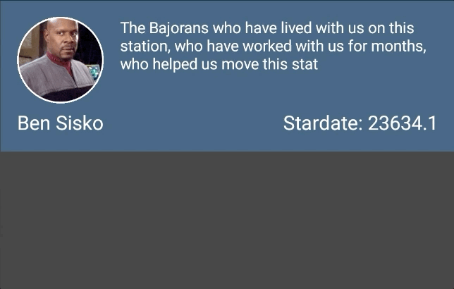
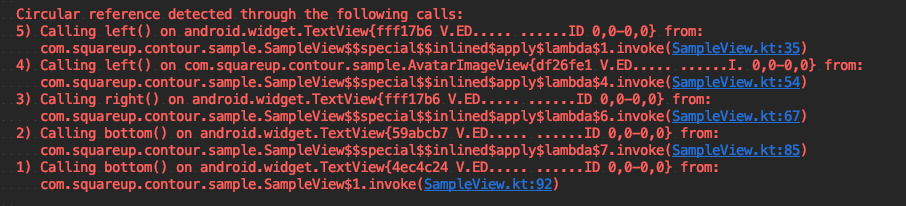

# Contour
Contour is a typesafe, Kotlin-first API for complex layouts on Android.

## What Contour Is Not
There is a lot of buzz and interest around writing views in code right now with the development of [Jetpack Compose](https://developer.android.com/jetpack/compose) & [Anko](https://github.com/Kotlin/anko).

### Contour is *not* Compose:
Compose is a programmatic UI toolkit that uses reactive programming to drive the views. In contrast Contour doesn’t care about the update mechanisms - whether they be FRP or plain old imperative. Contour is only concerned with the nuts and bolts of view layouts - and making them as flexible and easy as possible.

### Contour is *not* Anko:
Anko is JetBrain’s typesafe builder library for Android. It introduces none of its own layout logic, but provides convenience builders for the existing Android views and layouts. In contrast Contour provides its own layout mechanism - and actually discourages highly nested view hierarchies because it turns out they are [kinda problematic](https://developer.android.com/topic/performance/rendering/optimizing-view-hierarchies)

## What Contour Is:
Contour aims to be the thinnest possible wrapper around Android’s layout APIs. It allows you to build compound views in pure Kotlin without using opaque layout rules - but instead by hooking into the layout phase yourself. The best comparison for Contour would be to ConstraintLayout - but instead of defining constraints in XML you actually provide them as executable lambdas.

Also - on the topic of XML layouts ...

### Deprecating XML
XML had a good ride but times have changed and we should too. XML is a decent format for declaring static content - but that’s not what UIs are anymore. UIs increasingly have a ton of dynamic behavior - and trying to [jerry-rig](https://developer.android.com/topic/libraries/data-binding) XML layouts into adopting this dynamic behavior has taken things from bad to worse. What sort of dynamic behaviors do we expect from our UIs?
- Change configuration based on screen size
- Lazy loading elements of the UI.
- A / B testing components at runtime
- Dynamic theming
- Add & remove components based on app state

Let’s face it - XML is a static markup language and we’re trying to make it a full-fledged programming language. What’s the alternative? A full-fledged programming language! Kotlin! What sort of things do we get by abandoning the XML model?
- No findViewById - view declaration exists in scope.
- No R.id.my_view ambiguity - Kotlin has namespacing & encapsulation!
- Static typing!
- Great IDE Support (No more laggy xml editor)
- ViewHolders aren’t needed
- Easier DI

## Example
Let's create a simple note-taking view that displays a username aligned to the left, and fills the remaining horizontal space with the note.

```kotlin
class NoteView(context: Context) : ContourLayout(context) {
  private val name: TextView =
    TextView(context).layoutBy {
      text = "Ben Sisko"
      setTextColor(White)
      setTextSize(TypedValue.COMPLEX_UNIT_DIP, 18f)
      LayoutSpec(
        x = leftTo { parent.left() + 15.dip },
        y = topTo { parent.top() + 15.dip }
      )
    }

  private val note =
    TextView(context).layoutBy {
      text = siskoWisdom
      setTextColor(White)
      setTextSize(TypedValue.COMPLEX_UNIT_DIP, 14f)
      LayoutSpec(
        x = leftTo { name.right() + 15.dip }
          .rightTo { parent.right() - 15.dip },
        y = topTo { parent.top() + 15.dip }
      )
    }
}
```

We should also set the view height to match the `note: TextView` height, plus some padding.

```kotlin
init {
  contourHeightOf { description.bottom() + 15.dip }
}
```

Let's also introduce an avatar, and have its width and height match the width of the `name: TextView`.

```kotlin
  private val avatar =
    AvatarImageView(context).layoutBy {
      scaleType = ImageView.ScaleType.CENTER_CROP
      Picasso.get()
        .load("https://upload.wikimedia.org/wikipedia/en/9/92/BenSisko.jpg")
        .into(this)
      LayoutSpec(
        x = leftTo { name.left() }
          .widthOf { name.width() },
        y = topTo { name.bottom() }
          .heightOf { name.width().toY() }
      )
    }
```

Finally, let's insert a created date between the note content and the bottom of the view. If there is not enough content in the `note: TextView`, let's align the created date vertically with the name & icon.

```kotlin
  private val starDate = TextView(context).layoutBy {
    text = "Stardate: 23634.1"
    setTextColor(White)
    setTextSize(TypedValue.COMPLEX_UNIT_DIP, 18f)
    LayoutSpec(
      x = rightTo { parent.right() - 15.dip },
      y = maxOf(
        topTo { note.bottom() + 5.dip },
        bottomTo { name.bottom() }
      )
    )
  }
```

What does the end result of this look like?

<p align="center">
  
</p>

## Features
### Functional API
Similar to `ConstraintLayout`, Contour works by creating relationships between views' position and size. The difference is, instead of providing opaque XML attributes, you provide functions which are directly called during the layout phase.
This offers a couple advantages:

#### Runtime Layout Logic
Since configuration is simply provided through lambdas, you can make runtime layout decisions.
For example:
```kotlin
leftTo {
  if (user.name.isEmpty) parent.left()
  else nameView.right()
}
```
Or
```kotlin
heightOf {
  maxOf(note.height(), 100.dip)
}
```

#### Operators
You can use any of the Kotlin operators in your layouts for defining spacing, padding, etc.
```kotlin
rightTo { parent.right() - 15.dip }
```
Or
```kotlin
centerHorizontallyTo { parent.width() / 4 }
```

#### Context-Aware API
Contour tries to make it easy to do the right thing. As part of this effort, all of the layout functions return interfaces as views of the correct available actions.

For example, when defining a constraint of `leftTo`, the only exposed methods to chain in this layout are `rightTo` or `widthOf`. Another `leftTo`, or `centerHorizontallyTo` don't really make sense in this context and are hidden.
In short:
```
layoutBy(
  x = leftTo { name.left() }
    .leftTo { name.right() },
  y = topTo { name.bottom() }
)
```
Will not compile.

#### Axis Type Safety
Contour makes heavy use of inline classes to provide axis type safety in layouts. What this means is
```kotlin
toLeftOf { view.top() }
```
will not compile. `toLeftOf {}` requires a `XInt`, and `top()` returns a `YInt`. In cases where this needs to be forced, casting functions are made available to `toY()` & `toX()`.

Inline classes are a lightweight compile-time addition that allow this feature with minimal to no performance costs.
https://kotlinlang.org/docs/reference/inline-classes.html

### Circular Reference Debugging
Circular references are pretty easy to unintentionally introduce in any layout. To accidentally declare
- `name.right` aligns to `note.left`
- and `note.left` aligns to `name.right`

Contour fails fast and loud when these errors are detected, and provides as much context as possible when doing so. The screenshot below is an example of the trace provided when a circular reference is detected.

<p align="center">
  
</p>

## Releases
```groovy
implementation "app.cash.contour:contour:0.1.7"
```

Snapshots of the development version are available in [Sonatype's `snapshots` repository][snap].

```groovy
repositories {
  mavenCentral()
  maven {
    url 'https://oss.sonatype.org/content/repositories/snapshots/'
  }
}
```

## License

```
Copyright 2019 Square, Inc.

Licensed under the Apache License, Version 2.0 (the "License");
you may not use this file except in compliance with the License.
You may obtain a copy of the License at

    http://www.apache.org/licenses/LICENSE-2.0

Unless required by applicable law or agreed to in writing, software
distributed under the License is distributed on an "AS IS" BASIS,
WITHOUT WARRANTIES OR CONDITIONS OF ANY KIND, either express or implied.
See the License for the specific language governing permissions and
limitations under the License.
```

See terms and conditions [here](./LICENSE.txt).

 [snap]: https://oss.sonatype.org/content/repositories/snapshots/app/cash/contour/